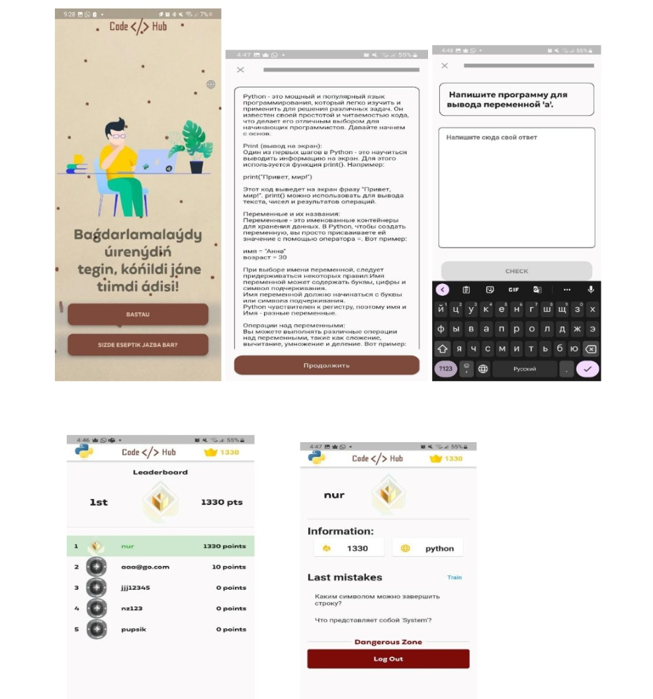

Автономная организация образования 
«Назарбаев Интеллектуальные школы»
Назарбаев Интеллектуальная школа
химико-биологического направления
г. Петропавловск

Тема: Приложение «CodeHub»
Направление: Математическое моделирование экономических и социальных процессов
Секция: Информатика

Выполнили:
Аканов Назар
Төлеген Нұрбатыр
Научный руководитель:
Ахмутинова Унзиля Мухамедкалиевна

Петропавловск
2023 г.
Оглавление
Эссе	- 2 -
Аннотация	- 4 -
Теоретическая часть	- 7 -
Как мы пришли к идее создания приложения?	- 7 -
Практическая часть	- 7 -
Результаты анкетирования №1	- 7 -
Разработка	- 11 -
На чем разрабатывался проект?	- 11 -
База данных	- 12 -
Структура приложения	- 13 -
Результаты анкетирования №2	- 15 -
Заключение	- 17 -
SWOT-анализ	- 17 -
Список используемой литературы	- 18 -

Эссе

Современная информационная эра требует от учащихся развития навыков аналитического мышления и программирования. Одной из актуальных проблем в образовании является неэффективная подготовка учащихся к внешним экзаменам по информатике. 
Приложение "CodeHub" предоставляет учащимся эффективные инструменты для развития навыков аналитического мышления и программирования. Благодаря интерактивному подходу и соревновательной атмосфере, оно позволяет ученикам эффективно подготовиться к экзамену и углубить понимание в этой сфере.
Подготовка к экзамену по информатике требует не только теоретических знаний, но и умения решать задачи. Приложение предлагает задачи разного уровня сложности, что помогает ученикам развивать навыки решения задач и отслеживать свои результаты.
Наш проект уникален по нескольким аспектам. Он представляет новаторский подход к обучению и подготовке учащихся. Комбинируя интерактивный подход, соревновательную атмосферу и индивидуальную обратную связь, приложение создает уникальную образовательную среду.
Кроме того, приложение предоставляет возможность готовиться к экзаменам не только на русском, но и на нашем родном казахском языке, что облегчит понимание материала учащимся, обучающемся на казахском отделении. 
Мы увлекались информатикой с начальной школы и с тех пор стремились участвовать во многих олимпиадах, проектах, хакатонах и других конкурсах. Также мы собираемся в этом году сами сдавать внешний экзамен по информатике и выбирать данный предмет в качестве профильного. 
Однако не все учащиеся имеют такую сильную мотивацию изначально, из-за чего впоследствии они получают низкие результаты, именно поэтому мы разработали приложение, чтобы помочь в подготовке нашей параллели, но затем поняли, что не будем на этом останавливаться. Мы приняли решение создать приложение, которое будет полезно не только учащимся в НИШ, но и в общеобразовательных школах. 
Таким образом, наша работа над приложением "CodeHub" имеет реальную практическую значимость. 

Аннотация
Приложение "CodeHub" представляет собой инновационную платформу, разработанную для эффективной подготовки учащихся к внешнему суммативному оцениванию и единому национальному тестированию по информатике. Основываясь на актуальных потребностях и результаты проведенного опроса, "CodeHub" предлагает учащимся интерактивные учебные материалы с разноуровневыми задачами, способствующими развитию аналитического мышления. Приложение обеспечивает мотивацию через соревновательный дух и командную работу, а также предоставляет возможность отслеживать прогресс и получать индивидуальную обратную связь для улучшения навыков. "CodeHub" представляет собой важный инструмент, способствующий повышению интереса учащихся к программированию и информатике в целом, а также обеспечивает успешную подготовку к экзаменам и достижение высоких результатов.
Abstract
The "CodeHub" application is an innovative platform designed to help students effectively prepare for external summative assessments and the national unified test in computer science. Based on the identified needs and the results of a conducted survey, "CodeHub" offers students interactive learning materials with tasks of varying difficulty levels that contribute to the development of analytical thinking. The application fosters motivation through a competitive spirit and teamwork, while also providing the ability to track progress and receive individual feedback to improve skills. "CodeHub" serves as an important tool to increase students' interest in programming and computer science, and ensures successful exam preparation and achievement of high results.
Введение
Приложение «CodeHub» разработано для помощи учащимся в эффективной подготовке к внешнему суммативному оцениванию и единому национальному тестированию по информатике. Основная цель проекта - обеспечить учащихся интерактивной платформой для более эффективной самостоятельной подготовки к внешним экзаменам.
	Актуальность темы
Благодаря опросу методического объединения информатики о результатах учащихся на ВСО была выявлена актуальность данной тематики. Результаты показывают, что достаточно много учащихся выбирают информатику в качестве профильного предмета, однако не все получают высокие результаты оценивания. Исходя из этого, возникла потребность создать мобильное приложение, где учащиеся могут готовиться к экзаменам, используя необходимые ресурсы и решая поставленные перед ними задачи.
Гипотеза проекта заключается в том, что создание доступного и интерактивного приложения для подготовки к экзаменам с использованием современных методов обучения и адаптивной системы может увеличить интерес учащихся к программированию и информатике в целом, снизить барьеры для начинающих и повысить качество обучения, что в конечном итоге приведет к увеличению числа учащихся, успешно написавших ВСО и ЕНТ.
Задачи
Для достижения цели исследования и проверки гипотезы были решены следующие задачи:
Провести входное тестирование для выявления актуальности темы исследования.
Проанализировать требования и создать концепцию приложения на основе собранных материалов.
Разработать прототип приложения.
Реализовать основные функциональные возможности.
Апробировать продукт на учащихся.
Улучшить и оптимизировать приложение на основе полученных результатов.
Приложение предлагает интерактивные учебные материалы с разноуровневыми задачами для легкого освоения информатики и программирования, а также для развития аналитического мышления. Важной функцией являются соревнования между участниками, способствующие повышению мотивации к изучению посредством соревновательного духа и командной работы. Продукт исследования также помогает учащимся отслеживать прогресс и получать обратную связь для улучшения своих навыков.
Таким образом, проект CodeHub представляет собой важный инструмент обучения и подготовки студентов к экзаменам, обеспечивая совместный подход, конкурентную среду и личную обратную связь.

Теоретическая часть
Как мы пришли к идее создания приложения?
 Обучаясь в Назарбаев Интеллектуальной школе, мы заметили, что многие ученики зачастую не хотят начинать подготавливаться к экзаменам заранее, ведь перечитывать весь материал и конспекты для них слишком скучно, в результате подготовка затягивается до самого последнего момента. Однако, после сдачи экзамена становится очевидным, какие негативные последствия может иметь такой выбор, проявляющиеся в плохих результатах на МЭСК, ЕНТ. Мы поняли, что из года в год эта проблема будет оставаться актуальной, поскольку ученики также будут продолжать откладывать подготовку на потом и из-за этого получать баллы ниже, хотя на самом деле могли показать результаты гораздо выше. Данная проблема присутствует не только в НИШ, но и в общеобразовательных школах. Понимая, что с этим надо что-то делать, мы провели опрос и на основе его результатов решили создать приложение, которое будет помогать учащимся, сдающим информатику в качестве профильного предмета, заранее к ней готовиться и в результате повышать не только свои собственные результаты, но и результаты школы в целом.
Практическая часть
Методы исследования, которые мы применяли: анкетирование и тестовые работы.
Результаты анкетирования №1
Для получения обратной связи со стороны учащихся мы взяли метод анкетирования. Из собранных ответов получили следующие результаты. Благодаря Microsoft Forms в голосование были включены в основном учащиеся в Назарбаев Интеллектуальных школах с разных городов (Семей, Тараз, Петропавловск, Алматы).

Вывод по анкетированию:
В опросе приняли участие учащиеся 7-10 классов Назарбаев интеллектуальных школ Петропавловска, Семея, Тараза и Алматы. Были выявлены причины, по которым учащийся заинтересован или не заинтересован в предмете. В большинстве случаев средние результаты по данному предмету были связаны с учителем и его способом преподавания, а именно: 50% из опрощенных указали, что слушают учителя на уроке и тем самым понимают предмет, но остальные 50% указали, что занимаются дополнительно. По результатам анкетирования можно заметить, что основная часть учащихся пользуется своими конспектами из книги или раздатками во время подготовки к СОР и СОЧ. При этом основная доля студентов тратит много времени на написание конспектов, в то время как некоторые не пишут их. Также ученики оценивали свою подготовку к ВСО (МЭСК). По результатам опроса видно, что более половины учащихся не готовы к сдаче экзамена.
 По результатам исследования можно выявить, что половина студентов используют разного рода приложения для подготовки к другим предметам, потому что в целом использование мобильных приложений для учебы очень удобно, ведь сейчас у каждого под рукой есть смартфон, и в любой момент можно достать его, чтобы подучить необходимый материал.
На вопрос «Заинтересовало бы вас приложение, содержащие материалы школьной программы по информатике?» 37 из 40 опрощенных учащихся выбрали ответ “Да”. С чем это связано? Для изучения информатики им не придется тратить время на поиски информации, ждать консультации или же своих одноклассников, потому что все данные будут структурированно содержаться на одной платформе. Можно отметить, что практически половина опрошенных уже пользуется такими приложениями, что означает, что это достаточно популярная практика среди других предметов. 3 из 40 учащихся, выбравшие “Нет” обосновывают это тем, что было бы удобнее обучаться вживую с учителем, нежели самостоятельно онлайн.
Для того, чтобы было удобнее отслеживать прогресс разработки, мы решили поделить его на разные этапы. Вот несколько этапов разработки приложения "CodeHub":
Определение цели приложения и требованиий к функциональности, интерфейсу и возможностям обратной связи с пользователями.
Проектирование пользовательского интерфейса. Разработка дизайна и структуры пользовательского интерфейса приложения, учитывая удобство использования и навигацию.
Разработка разнообразных задач и упражнений, которые помогут учащимся развивать навыки аналитического мышления и программирования.
Создание интерактивной среды и реализация интерактивных функций приложения, чтобы обеспечить взаимодействие пользователя с задачами и обратной связью.
Тестирование и отладка для исправления ошибок и неполадок.
Публикация и распространение среди учащихся образовательных учреждений.
Обратная связь (еще одно анкетирование) и обновления.
Поддержка пользователей, отвечая на их вопросы и предоставляя руководства и ресурсы.
Мониторинг и анализ использования приложения, чтобы понять его эффективность и внести необходимые изменения и улучшения.
Разработка
На чем разрабатывался проект?
Flutter - это фреймворк с открытым исходным кодом, созданный Google, который позволяет создавать сложные пользовательские интерфейсы на нескольких устройствах, независимо от того, является ли операционная система Android или iOS. Flutter использует язык программирования Dart, который является объектно-ориентированным, мульти платформенным языком программирования с открытым исходным кодом, созданным Google для разработки высокопроизводительных мобильных, веб- и настольных приложений. Почему именно flutter, а не что-то другое? Вот несколько причин:
•	Мультиплатформенность: Flutter позволяет разработчикам создавать сложные пользовательские интерфейсы на нескольких устройствах, независимо от того, является ли операционная система Android или iOS
•	Быстродействие: Flutter обеспечивает высокую производительность и быстродействие приложений. Это означает, что пользователи могут наслаждаться плавными анимациями и быстрым откликом приложения.
•	Безопасность: Flutter обеспечивает безопасное взаимодействие с нативным кодом. Это означает, что пользователи могут быть уверены в безопасности своих данных при использовании приложения.
В целом, Flutter - это мощный фреймворк, который предлагает множество преимуществ, включая легкость изучения, быструю разработку, мультиплатформенность, доступ к библиотекам, интеграцию с существующим нативным кодом и настраиваемыми виджетами.

База данных
Для хранения данных (пользователей, вопросов, текстов) мы решили использовать Firebase. Этот выбор обусловлен следующими преимуществами:
Данные в реальном времени: Firebase Realtime Database позволяет нам обновлять данные в реальном времени, что важно для предоставления актуальной информации пользователям.
Аутентификация и безопасность: Firebase предоставляет инструменты для аутентификации пользователей и обеспечения безопасности данных.
Масштабируемость: Firebase позволяет масштабировать приложение по мере его роста и увеличения числа пользователей.
Таким образом, использование языка программирования Dart и фреймворка Flutter, а также базы данных Firebase, обеспечивает нам эффективные инструменты для разработки и поддержки приложения "CodeHub", а также обеспечивает безопасность и доступность данных для наших пользователей.

Структура приложения
Мы тщательно анализировали другие приложения и их структуры, и пришли к тому, что есть сейчас у нас.
Вход и регистрация. Экран, на котором пользователи могут войти в свой аккаунт или зарегистрировать новый.

            

Задачи по теоретической части. На данной странице учащемуся будут данный теоретические задания, где он сможет почитать про них и пройти небольшой тест.
      

Задачи по программированию. Схожа с прошлой страницей, но на ней ученик будет практиковать именно практические навыки, то есть решать задачи по программированию.
Рейтинг. На данной странице будет таблица лидеров по баллам, которые зачисляются за прохождение разных уровней.

           
Профиль. На нем отображается базовая информация о вас, также там будет статистика о ваших очках за последние дни. Есть и недавние ошибки, который совершил ученик для рефлексии и повторения задач. Их можно порешать заново, нажав на кнопку “Тренироваться”. И, конечно же, кнопка выхода их аккаунта.

Результаты анкетирования №2

Вывод по анкетированию №2
В ходе второго анкетирования были сравнены результаты учащихся по суммативному оцениванию за одну четверть. По диаграмме можно заметить, что те учащиеся, которые повторяли темы, используя наше приложение, показывают результаты выше, нежели те, кто предпочел учиться по-другому. Из тех, кто пользовался нашим приложением, не нашлось ни одного ученика, набравшего ниже 40%. Большинство получило неплохую оценку за свою работу (65-84%). 
Стоит отметить, что ученики набирали хорошие баллы и без нашего приложения, но их количество по сравнению с нашими учениками меньше. Также стоить упомянуть, что многие получили за свою работу тройку (40-64%), и даже 2 (<40%).
На вопрос «Насколько вам понравилось пользоваться нашим приложением?» основная доля учащихся указали высокую оценку, потому что это помогло им сделать процесс подготовки более увлекательным и понятным, тем самым сэкономив драгоценное время. Однако, некоторые отметили, что при большой нагрузке (много пользователей одновременно пользовались приложением) запросы от базы данных приходили с задержкой, оценив приложение на 3-4 из-за технических неполадок.
Также мы спросили, что бы они хотели видеть в нашем приложении в будущем. В целом учащиеся отвечали по-разному, но хотелось бы выделить несколько ответов, которые будут включены в наши дальнейшие планы.
Сделать категорию избранных тем, где будут находиться соответственно избранные темы, чтобы сразу можно было подготовиться по ним.
Добавить полностью один пробник МЭСК и ЕНТ для того, чтобы учащийся мог проверить свои знания.
Добавить возможность скачивать материал, для того чтобы учиться даже оффлайн.

Заключение
Рефлексия: Несмотря на всю сложность проектирования и изучения теории, работа в команде оказалось интересной и сплоченной. Была проделана большая работа, где на создание теоретический материала уходило несколько дней, а на сам продукт недели. В целом группа полученным результатом довольна.
Вывод: Цель и поставленные задачи в работе полностью выполнены, было разработано приложение, которое содержит в себе основную информацию по разделам за 9-11 класс, а именно подготовленные конспекты и задания по ним для закрепления материала. “CodeHub” –это инновационное образовательное приложение, разработанное для эффективной подготовки учащихся к внешнему суммативному оцениванию по информатике, такому как МЭСК и ЕНТ. Однако, ученики могут использовать приложение также и для подготовки с СОР, СОЧ. Все это возможно благодаря широкому спектру учебного материала, предоставленного в интерактивной форме, что делает процесс обучения более привлекательным и эффективным. Также этому способствует и организация соревнований между участниками, поскольку это стимулирует соревновательный дух и мотивацию к обучению.
SWOT-анализ
S - сильные стороны
Данный проект имеет множество преимуществ. В первую очередь приложение предоставляет инновационный и интерактивный подход к обучению информатике.
Платформа предоставляет широкий спектр учебного контента и задач разной сложности.
CodeHub помогает как в подготовке к МЭСК и ЕНТ, так и в целом к суммативным оцениваниям.  
W - слабые стороны
Для использования приложения требуется доступ в интернет, что может стать ограничением для учеников из регионов с плохой интернет-инфраструктурой.
O – возможности
Ученики, подготовившись к разного рода экзаменам, смогут показывать свои лучшие результаты, тем самым поднимая личную оценку достижений в предмете и рейтинг школы.
T – угрозы
Изменения в учебных программах и стандартах могут потребовать обновления содержания приложения, которое займет некоторое время.

Список используемой литературы

Что такое flutter?   https://aws.amazon.com/ru/what-is/flutter/
Beautiful apps for every screen https://flutter.dev/multi-platform
Безопасность на flutter   https://habr.com/ru/articles/722466/
Сборник МЭСК 2016-2023 годов
Сборник ЕНТ 2016-2023 годов

# codeHub
 
